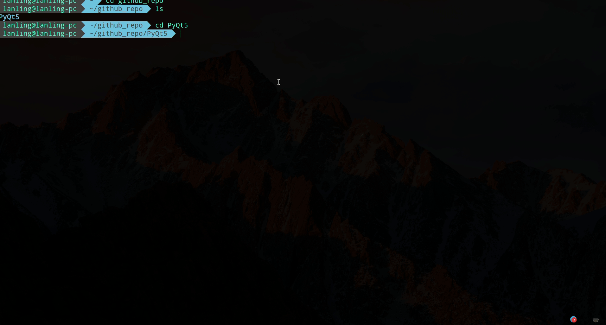

# A-Beautiful-PyQt5-Interface

Using qtdarkstyle and design layout without Qtdesigner

## Introduction

- Based on PyQt5, and qdarkstyle used
- Design layout, frame and splitter by myself
- A universal interface framework

## How to run

`python main.py` can run it.

## Dependent library version

- PyQt5: 5.13.1
- Python: 3.7.4

## Result

